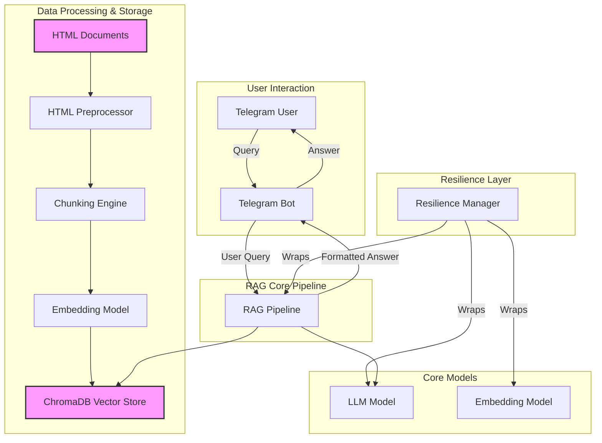

# RAG-based University Assistant Telegram Bot

This project is a sophisticated Retrieval-Augmented Generation (RAG) system implemented as a Telegram bot. It's designed to answer questions about a university, using a corpus of documents as its knowledge base. The bot is built with resilience, performance, and scalability in mind.


## 🌟 Key Features

- **Conversational AI**: Remembers conversation history for contextual follow-up questions.
- **Accurate & Factual**: Answers are generated based on a provided set of university documents, minimizing hallucination.
- **High Performance**:
    - **Optimized Embedding Model**: Features in-memory (LRU) and disk-based caching, plus batch processing for embedding generation.
    - **Query Caching**: Caches responses for frequently asked questions to provide instant answers.
- **Enterprise-Grade Resilience**:
    - **Circuit Breakers**: Prevents cascading failures when critical services (like LLM or embedding models) are down.
    - **Automatic Retries**: Implements exponential backoff and jitter to handle transient errors gracefully.
    - **Fallback Mechanisms**: Provides context-aware fallback responses if a model is unavailable.
- **Advanced Preprocessing**:
    - **HTML Parsing**: Processes complex HTML documents, including text and tables.
    - **Hierarchical Chunking**: Splits documents into parent and child chunks for improved retrieval accuracy.
- **Comprehensive Monitoring**:
    - **Performance Monitor**: Tracks CPU, memory, and disk usage.
    - **Resilience Stats**: Monitors circuit breaker states, retries, and fallback rates.
- **Interactive Telegram Bot**:
    - **Interactive Buttons**: For easy topic selection.
    - **Helpful Commands**: `/start`, `/help`, `/clear`, `/stats`, `/history`, `/health`.

## 🏛️ System Architecture

The RAG system is composed of several interconnected modules that handle the end-to-end process from data preprocessing to generating an answer.



For more details, see the [ARCHITECTURE.md](ARCHITECTURE.md) file.

## 🚀 Getting Started

### Prerequisites

- Python 3.9+
- A Telegram Bot Token
- A Hugging Face API Token (optional, for downloading models)

### 1. Clone the Repository

```bash
git clone https://github.com/your-username/RAG_model.git
cd RAG_model
```

### 2. Set Up Environment Variables

Create a `.env` file in the project root and add your tokens:

```env
TELEGRAM_BOT_TOKEN="your_telegram_bot_token"
HUGGINGFACE_API_TOKEN="your_huggingface_api_token"
```

### 3. Install Dependencies

It is recommended to use a virtual environment.

```bash
python -m venv venv
source venv/bin/activate  # On Windows, use `venv\Scripts\activate`
pip install -r requirements.txt
```

### 4. Run the Bot

To start the Telegram bot, run:

```bash
python main.py
```

The bot will start, and you can interact with it on Telegram.

## 🧪 Running Tests

The project includes a comprehensive test suite to ensure code quality and the reliability of its features.

To run all tests and view a coverage report:

```bash
pytest --cov=src --cov-report=term-missing
```

The tests cover:
- **Unit Tests**: For individual components like the resilience manager, models, and pipeline.
- **Integration Tests**: Ensuring that different parts of the system work together correctly.
- **Resilience Tests**: Validating that circuit breakers, retries, and fallbacks work as expected.

## ⚙️ Configuration

The main configuration for the project is located in `src/config.py`. Here you can adjust:
- Model names (`EMBEDDING_MODEL`, `LLM_MODEL`)
- Chunking parameters (`parent_chunk_size`, `child_chunk_size`, etc.)
- Database paths and collection names
- Default prompts and generation parameters

## 📚 Project Structure

```
RAG_model/
├── data/                 # Raw HTML documents
├── src/                  # Source code
│   ├── interface/        # Telegram bot interface
│   ├── models/           # LLM, embedding, and conversation models
│   ├── pipeline/         # RAG pipeline logic
│   ├── preprocess/       # Data preprocessing and chunking
│   ├── retrieval/        # Document retriever
│   └── utils/            # Utilities (performance, resilience)
├── tests/                # Test suite
├── .env                  # Environment variables (local)
├── main.py               # Main entry point to run the bot
├── requirements.txt      # Project dependencies
└── README.md             # This file
```

## 📄 Additional Documentation

- **[Performance Optimizations](PERFORMANCE_OPTIMIZATIONS.md)**: Details on caching, batching, and other performance enhancements.
- **[Resilience Features](RESILIENCE_FEATURES.md)**: In-depth explanation of the resilience and graceful degradation systems.

## 🤝 Contributing

Contributions are welcome! Please feel free to submit a pull request or open an issue.

1. Fork the repository.
2. Create your feature branch (`git checkout -b feature/AmazingFeature`).
3. Commit your changes (`git commit -m 'Add some AmazingFeature'`).
4. Push to the branch (`git push origin feature/AmazingFeature`).
5. Open a Pull Request.

## 📄 License

This project is licensed under the MIT License - see the `LICENSE` file for details.